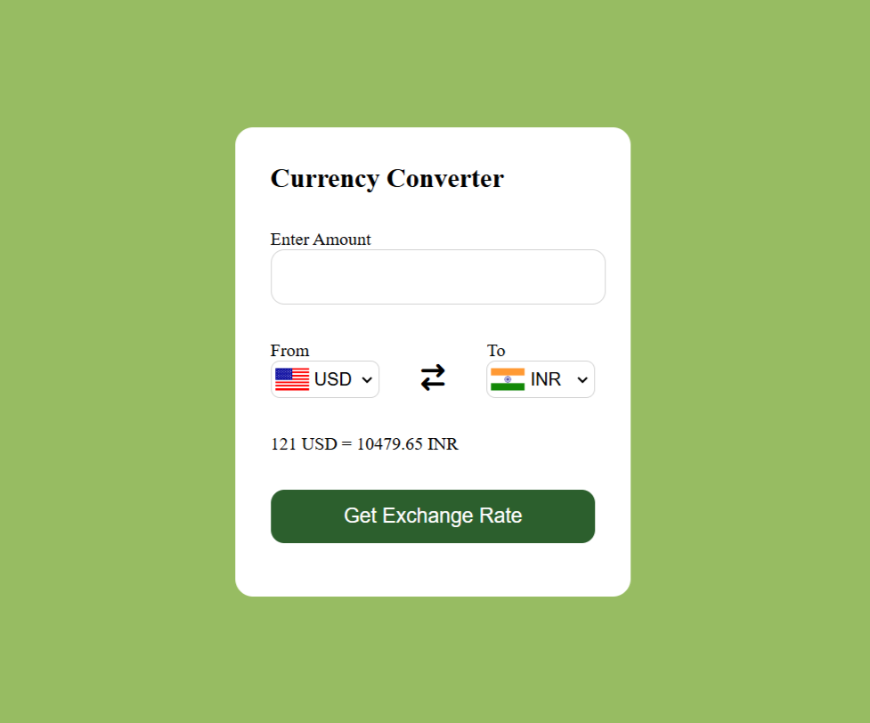

# 💱 Currency Converter Web App

A simple currency converter built using **HTML**, **CSS**, and **Vanilla JavaScript**.  
It allows users to convert one currency to another using **live exchange rates** and displays the **country flags** of selected currencies.

---

## 🚀 Features
- Real-time currency conversion using live exchange rates
- Dropdowns with country flags for a better user experience
- User-friendly input and output handling
- Responsive UI (mobile-friendly)

---

## 🔧 Tech Stack
- HTML5, CSS3
- JavaScript (ES6)
- APIs Used:
  - 📈 [Exchange Rate API (Fawaz Ahmed)](https://github.com/fawazahmed0/currency-api)  
  - 🏳️ [Country Flags API (flagcdn)](https://flagcdn.com)

---

## 🌐 Live Demo
👉 [Click here to try it live](https://currency-covert.netlify.app/)

---

## 📁 Project Structure

currency-convertor/ 
├── index.html  
├── style.css  
├── script.js  
├── README.md  
└── screenshot.png

---

## 📸 Screenshot

---

## 📚 What I Learned
- DOM manipulation and event handling
- Fetching and rendering data from multiple public APIs
- Dynamically updating UI using JavaScript
- Deploying static sites on Netlify
- Working with JSON data and async logic

---

## 📦 Future Improvements
- Add a loading spinner while fetching data
- Display historical exchange rate trends
- Add dark mode toggle
- Improve accessibility (ARIA roles, keyboard nav)

---

## 👨‍💻 Author

**Vaibhao Hatwar**  
💼 Aspiring Full Stack Web Developer  
📧 [vaibhaohatwar.works@gmail.com](mailto:vaibhaohatwar.works@gmail.com)  
🔗 [LinkedIn](https://www.linkedin.com/in/vaibhaohatwar) | [GitHub](https://github.com/VaibhaoHatwar)

---
